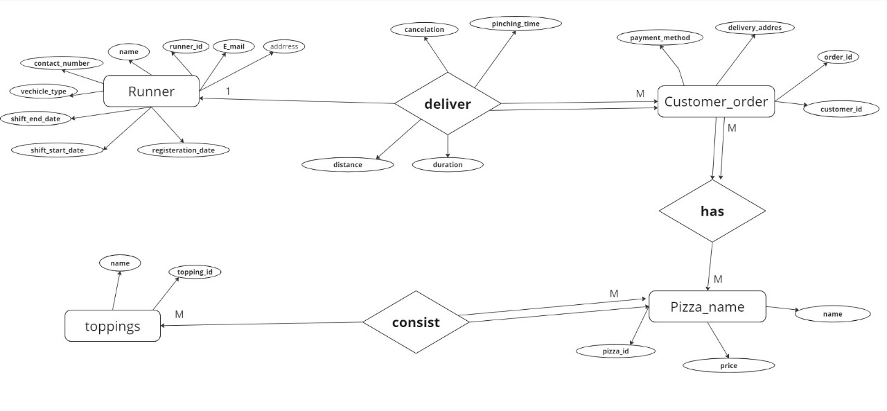

# Pizza Runner - Case Study 🍕

## Project Overview

This project is a comprehensive SQL-based case study focused on optimizing the operations of a fictional pizza delivery service, Pizza Runner. Through SQL queries, we analyze operational data and address business challenges presented in a series of structured questions. This case study is designed to enhance SQL skills in database design, data manipulation, and analytical querying.

## Link to Case Study
[Pizza Runner Case Study #2 Challenge](https://8weeksqlchallenge.com/case-study-2/)

## Process

### 1. Entity Relationship Diagram 
We started by analyzing the provided database structure and entity relationship diagram. To ensure data consistency and efficiency, we chose to normalize the database, making the schema more organized and adaptable. The resulting ERD reflects these modifications and serves as the foundation of this project.

### 2. Database Schema and Tables
Using SQL, we created the tables and ensured that all necessary constraints and relationships were in place. Each table was populated using stored procedures, designed to streamline the data insertion process according to the database rules.

### 3. Answering the Case Study Questions
The main focus of the case study is answering specific business questions across different areas:

- **Pizza Metrics**: Covers order volumes, unique customer orders, and the distribution of pizza types.
- **Runner and Customer Experience**: Analyzes delivery times, runner speeds, and customer satisfaction.
- **Ingredient Optimization**: Looks into frequently added extras, exclusions, and total ingredient usage.
- **Pricing and Ratings**: Evaluates revenue, delivery costs, and introduces a customer rating system.
- **Bonus DML Challenges**: Additional data challenge.

### 4. Files and Folder Structure

- **`Answering The Case Study Questions.sql`**: Contains all SQL queries organized by the different question groups within the case study.
- **`DML and DDL - Creating and Inserting.sql`**: SQL scripts for creating tables and inserting initial data.
- **`Customer order Table - DML.sql`**: Stored procedures for the`Customer Order` table.
- **`Pizza names Table - DML.sql`**: Stored procedures for the `Pizza Names` table.
- **`Pizza recipes Table - DML.sql`**: Stored procedures for the `Pizza Recipes` table.
- **`Runners Table- DML.sql`**:  Stored procedures for the `Runners` table.
- **`Topping Table - DML.sql`**: Stored procedures for the `Topping` table.
- **`PizzaProject.bak`**: Database backup file.

## Conclusion
This case study involved creating a structured database, data population through stored procedures, and answering complex business questions with SQL. By focusing on normalization and optimizing database design, we provided valuable insights for the operations of Pizza Runner. Each question showcases how SQL can solve real world business challenges, from tracking pizza metrics to improving customer experience.

